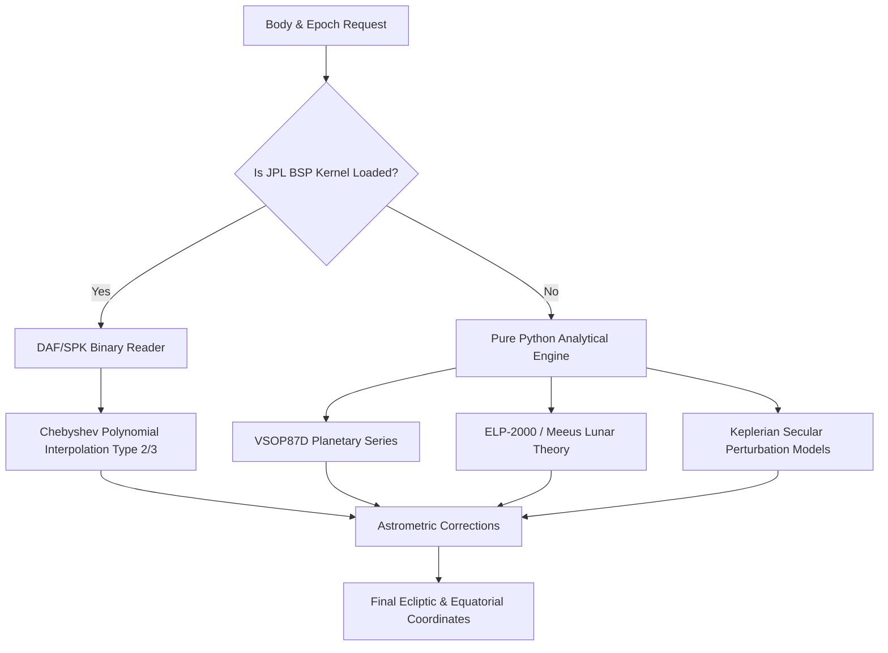

# Ephemerides & Celestial Mechanics

EdelCore provides a high-performance, multi-tier ephemeris architecture supporting major planets, small bodies/asteroids, lunar points, and fixed stars.

---

## 1. Dual Ephemeris Engine Architecture

---

## 2. Standalone Planetary Engine (VSOP87D)

When no JPL binary file is provided, EdelCore uses the French Bureau des Longitudes **VSOP87D** (Variations Séculaires des Orbites Planétaires) analytical theory:

For each coordinate (Heliocentric Longitude $L$, Latitude $B$, Radius Vector $R$):
$$X(t) = \sum_{\alpha=0}^{5} \tau^\alpha \left( \sum_{i=1}^{N_\alpha} A_i \cos(B_i + C_i \tau) \right)$$
Where:
- $\tau = T / 10$ is the time in Julian millennia since J2000.0 ($T$ in Julian centuries).
- Coefficients $A_i, B_i, C_i$ model gravitational perturbations from all solar system bodies.

### Earth $\to$ Sun Transformation
The geocentric coordinates of the Sun are derived directly by inverting the Earth's heliocentric position:
$$L_\odot = (L_\oplus + \pi) \pmod{2\pi}, \quad B_\odot = -B_\oplus, \quad R_\odot = R_\oplus$$

---

## 3. High-Precision Lunar Engine (ELP-2000/82B)

The Moon's orbit is highly perturbed by the Sun and Earth's oblateness. EdelCore evaluates the Chapront & Meeus truncated ELP-2000 periodic terms using fundamental Delaunay arguments:
- $L'$: Mean longitude of the Moon
- $D$: Mean elongation of the Moon from the Sun
- $M$: Mean anomaly of the Sun
- $M'$: Mean anomaly of the Moon
- $F$: Mean argument of latitude of the Moon

$$\lambda_{\text{Moon}} = L' + \sum A \sin(i_D D + i_M M + i_{M'} M' + i_F F) + \text{Perturbations}$$

---

## 4. Lunar Nodes & Lunar Apogee (Lilith)

EdelCore computes both Mean and True (Osculating) points:

### 1. Mean & True Lunar Node ($\Omega$)
- **Mean Node (Rahu):**
  $$\Omega_{\text{mean}} = 125.0445222^\circ - 1934.1362608^\circ T + 0.0020708^\circ T^2 + \frac{T^3}{450000}^\circ$$
- **True Node (Osculating Rahu):**
  $$\Omega_{\text{true}} = \Omega_{\text{mean}} - 1.4979^\circ \sin(2D - 2F) - 0.1500^\circ \sin(M) - 0.1226^\circ \sin(2D) + 0.1176^\circ \sin(2F)$$
- **South Node (Ketu):** $(\Omega + 180^\circ) \pmod{360^\circ}$

### 2. Mean & True Lilith (Black Moon / Lunar Apogee)
- **Mean Lilith:** $\varpi_{\text{Moon}} + 180^\circ$ where $\varpi$ is the longitude of lunar perigee:
  $$\varpi_{\text{mean}} = 83.35324312^\circ + 4069.0137287^\circ T - 0.0103238^\circ T^2$$
- **True Lilith (Osculating Apogee):** Evaluates evection and variation solar perturbation harmonics.

---

## 5. Small Bodies (Chiron & Asteroids)

EdelCore includes Keplerian osculating elements with secular rates for major astrological minor planets:
- **2060 Chiron** (Centaur, Period $\approx 50.45$ yr, $a = 13.65$ AU)
- **1 Ceres** (Dwarf Planet, Period $\approx 4.60$ yr, $a = 2.77$ AU)
- **2 Pallas** (Asteroid, Period $\approx 4.61$ yr, $a = 2.77$ AU)
- **3 Juno** (Asteroid, Period $\approx 4.36$ yr, $a = 2.67$ AU)
- **4 Vesta** (Asteroid, Period $\approx 3.63$ yr, $a = 2.36$ AU)

---

## 6. Supported Body Constants

| Body Constant | Type | Mean Daily Motion |
| :--- | :--- | :--- |
| `Body.SUN` | Star | $\approx 0.9856^\circ$ / day |
| `Body.MOON` | Satellite | $\approx 13.176^\circ$ / day |
| `Body.MERCURY` | Inner Planet | $\approx 4.092^\circ$ / day (Mean) |
| `Body.VENUS` | Inner Planet | $\approx 1.602^\circ$ / day (Mean) |
| `Body.MARS` | Superior Planet | $\approx 0.524^\circ$ / day (Mean) |
| `Body.JUPITER` | Gas Giant | $\approx 0.0831^\circ$ / day |
| `Body.SATURN` | Gas Giant | $\approx 0.0335^\circ$ / day |
| `Body.URANUS` | Ice Giant | $\approx 0.0117^\circ$ / day |
| `Body.NEPTUNE` | Ice Giant | $\approx 0.0060^\circ$ / day |
| `Body.PLUTO` | Dwarf Planet | $\approx 0.0040^\circ$ / day |
| `Body.CHIRON` | Centaur | $\approx 0.0195^\circ$ / day |
| `Body.CERES` | Asteroid | $\approx 0.2141^\circ$ / day |
| `Body.PALLAS` | Asteroid | $\approx 0.2137^\circ$ / day |
| `Body.JUNO` | Asteroid | $\approx 0.2261^\circ$ / day |
| `Body.VESTA` | Asteroid | $\approx 0.2715^\circ$ / day |
