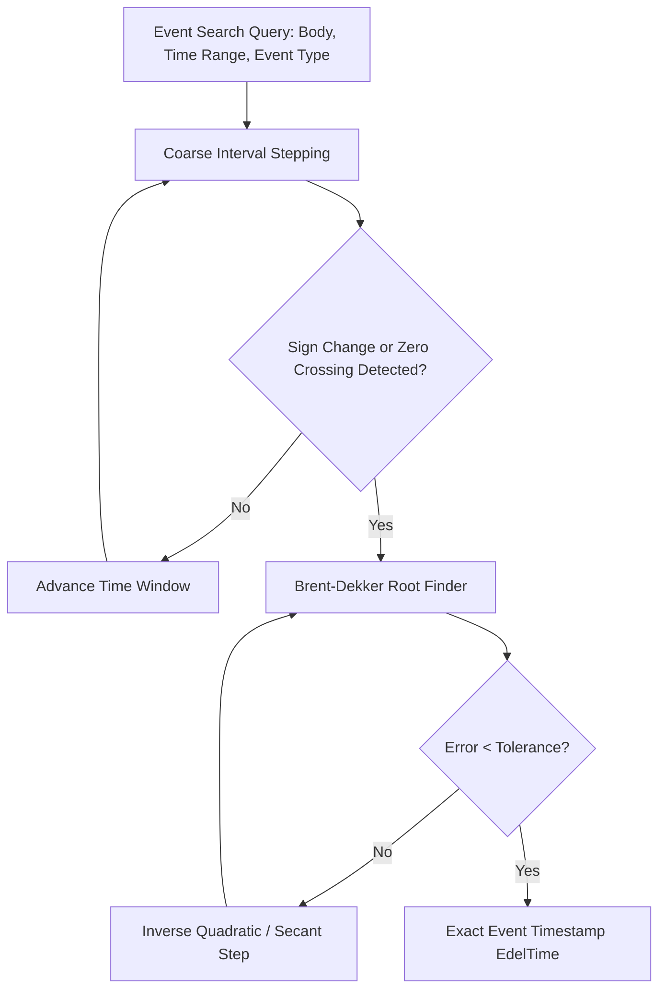

# Astronomical Event Search Engine

The `edelcore.events` module provides high-precision root-finding solvers to locate time-critical astronomical occurrences with sub-second accuracy.

---

## 1. Search Engine Architecture



---

## 2. Supported Search Solvers

### A. Degree Transit Search (`search_transit_time`)
Finds the exact moment when a celestial body reaches any target ecliptic longitude $\lambda_{\text{target}} \in [0^\circ, 360^\circ)$.

```python
from datetime import datetime
from edelcore import EdelEngine, Body, EdelTime

engine = EdelEngine()

# Find exact moment Moon reaches 180° (0° Libra)
t_start = EdelTime.from_datetime(datetime(2026, 8, 1))
t_end = EdelTime.from_datetime(datetime(2026, 8, 10))

t_crossing = engine.search_transit(Body.MOON, target_lon_deg=180.0, start_time=t_start, end_time=t_end)
if t_crossing:
    y, m, d, h, mn, s = t_crossing.calendar
    print(f"Moon crosses 180° at {y:04d}-{m:02d}-{d:02d} {h:02d}:{mn:02d}:{s:04.1f} UT")
```

### B. Zodiac Sign Ingress Search (`search_sign_ingresses`)
Locates every boundary crossing ($0^\circ, 30^\circ, 60^\circ, \dots, 330^\circ$) across any continuous time interval:

```python
# Find all Sun sign entries in Autumn 2026
t_start = EdelTime.from_datetime(datetime(2026, 8, 1))
t_end = EdelTime.from_datetime(datetime(2026, 11, 1))

ingresses = engine.search_sign_ingresses(Body.SUN, t_start, t_end)
for t_ing, sign_idx in ingresses:
    y, m, d, h, mn, s = t_ing.calendar
    print(f"Sun enters sign {sign_idx} at {y:04d}-{m:02d}-{d:02d} {h:02d}:{mn:02d}:{s:04.1f} UT")
```

### C. Stationary Turning Points (`search_stations`)
Locates exact inflection points where longitudinal orbital speed changes sign ($v_\lambda(t) = 0$):
- **Direct $\to$ Retrograde:** Planet slows to a halt and begins westward motion.
- **Retrograde $\to$ Direct:** Planet halts and resumes eastward direct motion.

```python
# Find all Mercury retrograde stations in 2026
t_start = EdelTime.from_datetime(datetime(2026, 1, 1))
t_end = EdelTime.from_datetime(datetime(2026, 12, 31))

stations = engine.search_stations(Body.MERCURY, t_start, t_end)
for t_st, st_type in stations:
    y, m, d, h, mn, s = t_st.calendar
    pos = engine.ephemeris.calculate_body(Body.MERCURY, t_st)
    print(f"Mercury Station ({st_type}) at {y:04d}-{m:02d}-{d:02d} {h:02d}:{mn:02d}:{s:04.1f} UT (Lon: {pos.longitude:.4f}°)")
```

---

## 3. Brent-Dekker Root-Finding Method

The search engine uses **Brent's method**, which combines root bracketing, bisection, and inverse quadratic interpolation to guarantee superlinear convergence without risking derivative singularities:

$$s = \frac{a f(b) f(c)}{(f(a)-f(b))(f(a)-f(c))} + \frac{b f(a) f(c)}{(f(b)-f(a))(f(b)-f(c))} + \frac{c f(a) f(b)}{(f(c)-f(a))(f(c)-f(b))}$$

Default convergence tolerance is $< 0.5$ seconds ($\approx 10^{-6}$ degrees in solar motion).
