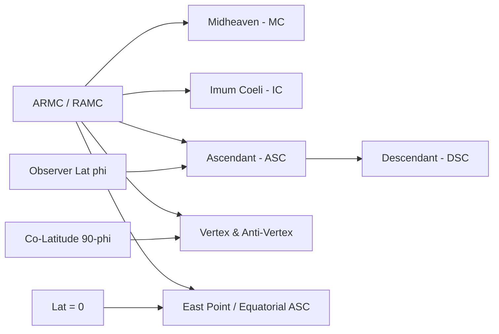

# House Systems & Astrological Angles

The `edelcore.houses` engine provides spherical trigonometry implementations for 12 house division systems, fundamental astrological angles, and polar safeguards.

---

## 1. Primary Astrological Angles

### Midheaven (MC / Medium Coeli)
The intersection of the local meridian with the ecliptic:
$$\tan(\text{MC}) = \frac{\tan(\text{ARMC})}{\cos(\epsilon)}$$

### Ascendant (ASC / Horoscopus)
The Eastern intersection of the observer's horizon with the ecliptic:
$$\tan(\text{ASC}) = \frac{\cos(\text{RAMC})}{-\left(\sin(\text{RAMC}) \cos(\epsilon) + \tan(\phi) \sin(\epsilon)\right)}$$

### Vertex (VTX)
The Western intersection of the prime vertical with the ecliptic:
$$\text{Vertex} = \text{ASC}\left(\text{RAMC} + 180^\circ, \, 90^\circ - |\phi|\right)$$

### East Point (EP / Equatorial Ascendant)
$$\text{East Point} = \text{ASC}(\text{RAMC}, \, \phi = 0^\circ)$$

---

## 2. Supported House Systems

EdelCore implements 12 distinct house systems via exact spherical geometry:

| House System | System Enum | Mathematical Basis |
| :--- | :--- | :--- |
| **Placidus** | `HouseSystem.PLACIDUS` | Time-proportional trisection of diurnal/nocturnal semi-arcs |
| **Koch (GOH)** | `HouseSystem.KOCH` | Trisection of the Oblique Ascension of the Midheaven |
| **Regiomontanus** | `HouseSystem.REGIOMONTANUS` | Equator division through horizon meridian circles |
| **Campanus** | `HouseSystem.CAMPANUS` | Prime vertical divided into equal $30^\circ$ sectors |
| **Topocentric** | `HouseSystem.TOPOCENTRIC` | Polich-Page time-proportional tangent pole formula |
| **Porphyry** | `HouseSystem.PORPHYRY` | Exact trisection of the ecliptic quadrant between ASC and MC |
| **Whole Sign** | `HouseSystem.WHOLE_SIGN` | Cusp 1 = $0^\circ$ of the zodiac sign containing the Ascendant |
| **Equal** | `HouseSystem.EQUAL` | Cusp 1 = ASC, with each subsequent cusp incremented by $+30^\circ$ |
| **Vehlow Equal** | `HouseSystem.VEHLOW_EQUAL` | ASC located at $15^\circ$ of House 1 |
| **Morinus** | `HouseSystem.MORINUS` | Equator divided into equal $30^\circ$ arcs projected to ecliptic |
| **Meridian (Axial)**| `HouseSystem.MERIDIAN` | Equator divided into equal $30^\circ$ arcs from ARMC |
| **Alcabitius** | `HouseSystem.ALCABITIUS` | Trisection of the semi-diurnal arc of the Ascendant on the equator |

---

## 3. Placidus Semi-Arc Iteration

Placidus houses divide diurnal semi-arcs (DSA) and nocturnal semi-arcs (NSA) into equal thirds:
For a point $\lambda$ with declination $\delta(\lambda)$ and right ascension $\alpha(\lambda)$:
$$\text{DSA}(\lambda) = \frac{\pi}{2} + \arcsin(\tan\phi \tan\delta)$$
$$\text{Condition: } |\text{RAMC} - \alpha(\lambda)| = f \cdot \text{DSA}(\lambda)$$

EdelCore solves this non-linear transcendental equation using **adaptive iterative pole convergence**:
$$\tan(\phi_{\text{eff}}) = \frac{\sin(f \cdot \text{AD})}{\tan\delta}$$
$$\lambda_{k+1} = \text{ASC}(\text{RAMC} + \text{offset}, \, \phi_{\text{eff}})$$

---

## 4. Extreme Polar Safeguards ($|\phi| > 66^\circ$)

Inside the Arctic / Antarctic circles ($|\phi| > 66.5^\circ$), the ecliptic does not always intersect the horizon (circumpolar phenomena), causing semi-arc systems like Placidus and Koch to fail mathematically.

EdelCore provides an **automated graceful fallback** to Porphyry quadrant division when $|\phi| > 66^\circ$, guaranteeing that all 12 cusps are always non-null, valid, and geometrically continuous.
