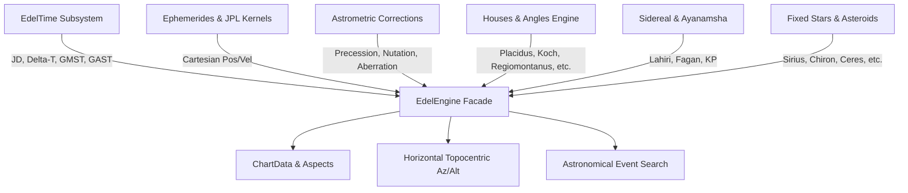

# EdelCore: High-Precision Astrological & Astronomical Computation Engine

[](https://pypi.org/project/edelcore/)
[](https://pypi.org/project/edelcore/)
[](https://opensource.org/licenses/MIT)
[]()

**EdelCore** is a high-precision, pure-Python ephemeris and astrological computation engine built on IAU 2000/2006 and NASA JPL standards, delivering sub-arcsecond accuracy with zero C dependencies.

Designed for astrophysicists, astrologers, computational historians, and developers, EdelCore provides transparent, auditable mathematical implementations of planetary mechanics, lunar theories, spherical trigonometry house divisions, fixed stars, and time reductions.

---

## Key Architecture Pillars



### 1. Pure Python / Zero-Black-Box Architecture
EdelCore is written purely in clean, modern Python (with optional numpy vectorization) without external C wrapper binaries. Every formula—from the 77-term IAU 2000B nutation matrix to the Newton-Raphson Placidus semi-arc solver—is transparent, auditable, and fully reproducible.

### 2. Dual-Engine Ephemeris Pipeline
- **JPL SPICE Evaluator:** Reads NASA binary SPK / BSP kernels (`de440.bsp`, `de441.bsp`, `de405.bsp`) and evaluates Chebyshev polynomials for millimeter-level barycentric precision.
- **Standalone Analytical Engine:** Closed-form VSOP87D planetary theory, ELP-2000/82B Lunar theory, and Keplerian secular models for asteroids (Chiron, Ceres, Pallas, Juno, Vesta) requiring no external data files.

### 3. Rigorous Astrometric Reductions
- Light-time travel iteration ($t - \tau$)
- Annual aberration and relativistic solar gravitational deflection
- IAU 2000B Nutation in longitude ($\Delta\psi$) and obliquity ($\Delta\epsilon$)
- IAU 2006 Mean and True Obliquity of the Ecliptic ($\epsilon$)
- Topocentric parallax correction for exact observer elevation and WGS84 coordinates
- Saemundsson / Bennett atmospheric refraction for true vs. apparent horizon coordinates

### 4. Comprehensive Astrological Subsystems
- **12 House Systems:** Placidus, Koch, Regiomontanus, Campanus, Topocentric (Polich-Page), Porphyry, Equal, Whole Sign, Vehlow Equal, Morinus, Meridian (Axial), and Alcabitius.
- **Extreme Latitude Protection:** Automated graceful handling for circumpolar regions ($|\phi| > 66^\circ$).
- **Sidereal Modes:** Lahiri (Chitrapaksha), Krishnamurti (KP), Fagan-Bradley, Raman, Ushashashi, Yukteshwar, True Citra, True Pushya, and custom offsets.
- **Event Search Engine:** High-precision Brent-Dekker root finding for degree transits, sign ingresses, and stationary retrograde turning points.

---

## Quick Example

```python
from datetime import datetime
from edelcore import EdelEngine, HouseSystem, Body

# Initialize engine
engine = EdelEngine()

# Calculate complete birth chart for London
chart = engine.calculate_chart(
    dt_or_time=datetime(2026, 8, 20, 21, 4, 0),
    lat_deg=51.5074,
    lon_deg=-0.1278,
    house_system=HouseSystem.PLACIDUS
)

# Print human-readable summary
print(chart.summary())

# Access planetary positions & speeds
sun = chart.bodies[Body.SUN]
print(f"Sun Longitude: {sun.longitude:.4f}°, Speed: {sun.speed_longitude:+.4f}°/day")
```
